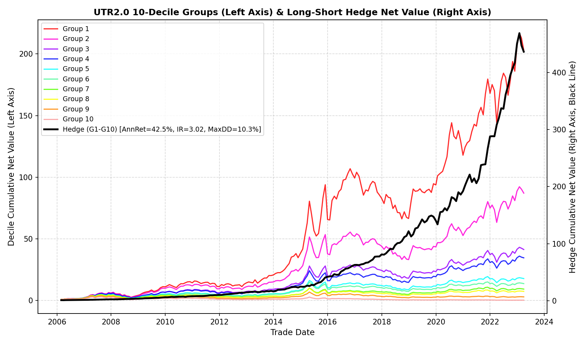
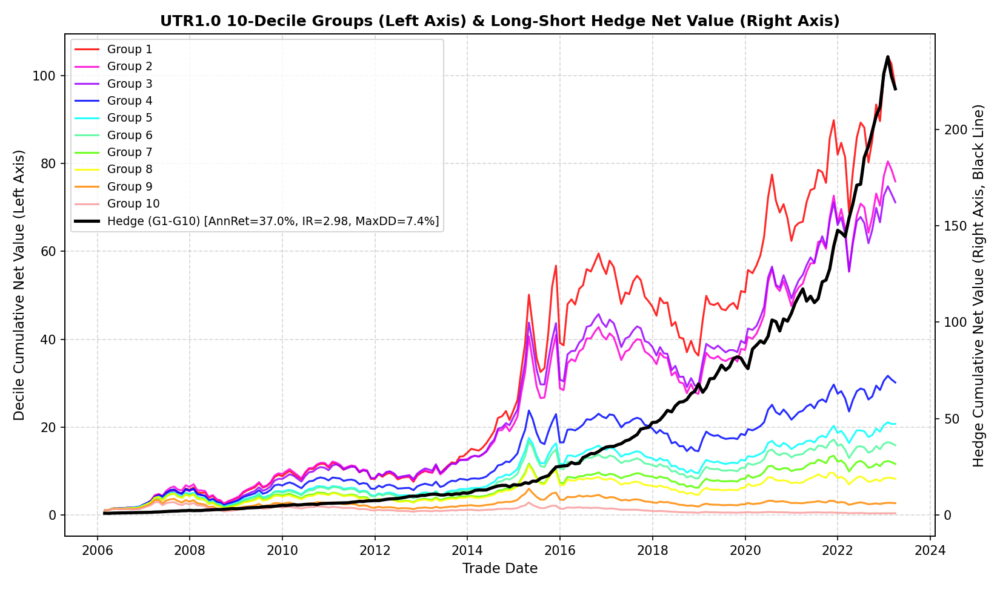
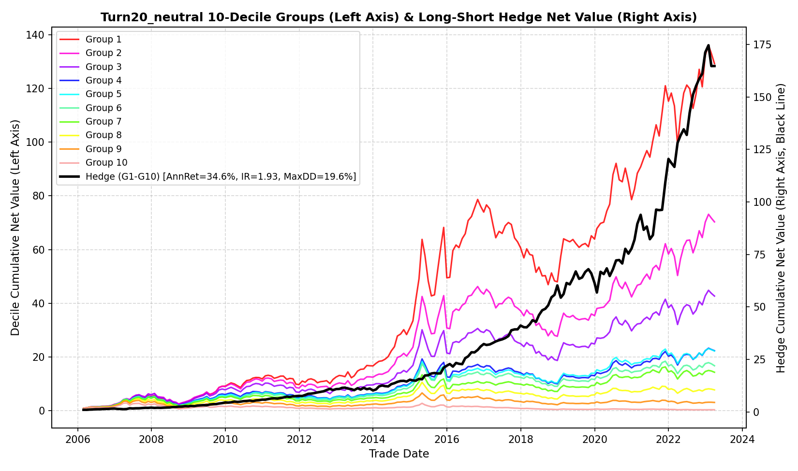
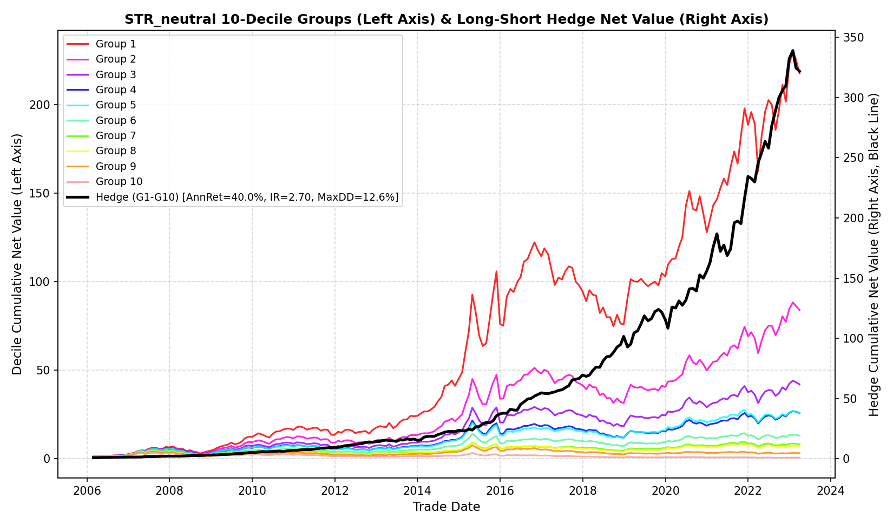

# UTR 2.0 Factor Reproduction

## Task

This repository reproduces the Dongwu Securities report on the enhanced turnover factor, **UTR 2.0**. The project rebuilds the factor pipeline, applies practical trading constraints, runs decile backtests, and reports the performance of UTR 1.0, UTR 2.0, Turn20, and STR factors.

## Key Results

The backtest uses a strict **T+1 execution lag** to avoid close-price timing lookahead bias. The reproduced report covers January 2006 to March 2023.

| UTR 2.0 | UTR 1.0 |
| :---: | :---: |
|  |  |

| Turn20 Neutral | STR Neutral |
| :---: | :---: |
|  |  |

## Repository Structure

```text
.
+-- scripts\                  # Reproduction, factor, backtest, and report utilities
+-- outputs\                  # Generated reports, factor data, charts, and summaries
+-- Barra_CNE5\               # Barra style factor inputs
+-- AShare_Listdate.csv       # Listing date input
+-- Ashare_suspension.csv     # Suspension input
+-- derivative.csv            # Turnover and derivative market data
+-- industry_class_CITICS.csv # CITICS industry classification
+-- price.csv                 # Price and volume input
+-- st.csv                    # ST status input
```

## Main Scripts

| File | Role |
| :--- | :--- |
| `scripts\data_scan.py` | Scans raw CSV inputs and writes the data quality report. |
| `scripts\calc_factors.py` | Builds Turn20, STR, UTR 1.0, UTR 2.0, and neutralized factor data. |
| `scripts\backtest.py` | Runs T+1 decile backtests, IC analysis, holding summaries, and charts. |

## Run Order

```powershell
& "C:\Users\Isaac\AppData\Local\Programs\Python\Python311\python.exe" ".\scripts\data_scan.py"
& "C:\Users\Isaac\AppData\Local\Programs\Python\Python311\python.exe" ".\scripts\calc_factors.py"
& "C:\Users\Isaac\AppData\Local\Programs\Python\Python311\python.exe" ".\scripts\backtest.py"
```

## Outputs

- `outputs\final_report.md`: final reproduction report.
- `outputs\factors.csv`: generated factor panel.
- `outputs\04_backtest_review.md`: backtest metrics and review.
- `outputs\*.png`: decile and hedge net value charts.

Raw data files are treated as read-only inputs.
