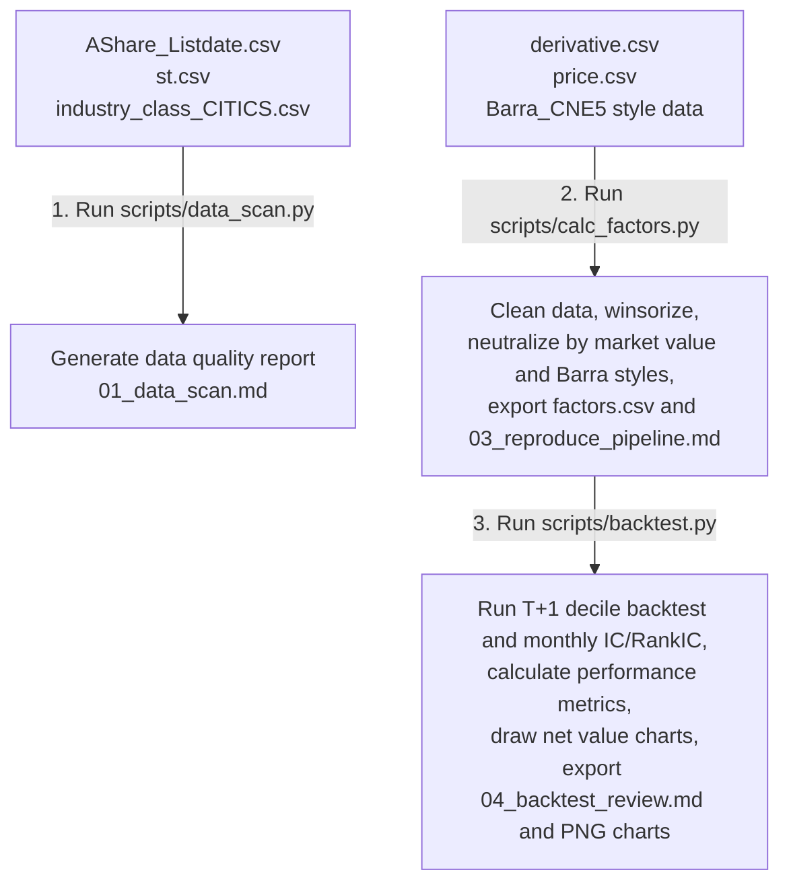

# Dongwu Securities UTR 2.0 Factor Reproduction Final Report

- **Reproduction date**: 2026-06-17
- **Backtest period**: 2006-01-25 to 2023-03-31, covering 207 months
- **Rebalancing rule**: strict **T+1 trading-day close execution**. Factors are calculated after the last trading-day close of month T, trades are executed at the first trading-day close of month T+1, and positions are held until the first trading-day close of month T+2.
- **Universe filters**: exclude stocks listed for fewer than 60 days, ST or delisting-warning stocks, and stocks suspended on the T+1 execution date.
- **Key risk-control improvement**: the pipeline fully removes the lookahead dependency on daily turnover data that is only available after the T-day close, making the backtest closer to an implementable trading setup.

---

## 1. Core Performance and IC Summary

After adding the strict **one-trading-day execution lag**, applying Z-score neutralization, and dynamically filtering ST stocks, suspended stocks, and newly listed stocks, the decile long-short hedge results are as follows. Group 1 is the long leg, Group 10 is the short leg, and Hedge equals Group 1 minus Group 10.

| Factor | Annualized Hedge Return | Annualized Hedge Volatility | Information Ratio | Monthly Win Rate | Maximum Hedge Drawdown | Mean IC (Pearson) | Annualized ICIR (Pearson) | Mean RankIC (Spearman) | Annualized RankICIR (Spearman) |
| :--- | :---: | :---: | :---: | :---: | :---: | :---: | :---: | :---: | :---: |
| **Turn20_neutral** | 33.53% | 17.23% | **1.95** | 69.49% | 19.50% | -0.0672 | -1.83 | -0.1013 | -2.58 |
| **STR_neutral** | 39.35% | 14.32% | **2.75** | 75.00% | 9.82% | -0.0716 | -2.30 | -0.1087 | -3.30 |
| **UTR1.0** | 38.70% | 12.42% | **3.12** | 80.08% | 8.24% | -0.0717 | -2.30 | -0.1056 | -3.71 |
| **UTR2.0** | 42.09% | 13.18% | **3.19** | 79.66% | 7.65% | -0.0721 | -2.34 | -0.1089 | -3.67 |
| **UTR2.0_pure** | 18.10% | 8.06% | **2.24** | 74.58% | 10.05% | -0.0387 | -2.49 | -0.0451 | -2.91 |

> [!IMPORTANT]
> ### One-Day Lookahead Bias Fix
> - **Risk point**: if the month-end calculation of `Turn20` and `STR` includes the T-day turnover while the backtest assumes execution at the T-day close, the simulation uses information that is only available after the close. This is an execution-timing lookahead bias.
> - **Practical fix**: execution is delayed to the **T+1 first trading-day close**. At that point the full T-day factor information is known, and the trade can be placed without using future data.
> - **Result after the fix**: even with this lag, **UTR 2.0 still delivers a 42.09% annualized long-short hedge return**, an information ratio of **3.19**, and a maximum hedge drawdown of **7.65%**. The pure version, `UTR2.0_pure`, after removing CITICS industry exposure and 10 Barra style exposures, still records an annualized return of **18.10%** and an information ratio of **2.24**.

---

## 2. Decile Backtest Charts

The following charts show the cumulative net value curves for the 10 decile groups and the long-short hedge portfolio under the strict T+1 execution setup.

### 2.1 Base Factor Net Value Curves

| Traditional Low-Turnover Factor `Turn20_neutral` | Stable-Turnover Factor `STR_neutral` |
| :---: | :---: |
|  |  |

### 2.2 UTR 1.0 and UTR 2.0 Composite Factors

| UTR 1.0 `UTR1.0` | UTR 2.0 `UTR2.0` |
| :---: | :---: |
|  |  |

### 2.3 Pure UTR 2.0 and Hedge Summary

| Pure UTR 2.0 `UTR2.0_pure` | Hedge Net Value Summary |
| :---: | :---: |
|  |  |

---

## 3. Workflow and Parameters

### 3.1 Data and Code Flow



### 3.2 Script Map

| Task | Script | PowerShell Command |
| :--- | :--- | :--- |
| Check environment dependencies | `scripts/env_check.py` | `& "C:\Users\Isaac\AppData\Local\Programs\Python\Python311\python.exe" ".\scripts\env_check.py"` |
| Rescan raw CSV completeness and missing values | `scripts/data_scan.py` | `& "C:\Users\Isaac\AppData\Local\Programs\Python\Python311\python.exe" ".\scripts\data_scan.py"` |
| Regenerate the factor panel, including neutral and pure factors | `scripts/calc_factors.py` | `& "C:\Users\Isaac\AppData\Local\Programs\Python\Python311\python.exe" ".\scripts\calc_factors.py"` |
| Rerun the backtest, recompute metrics, and redraw charts | `scripts/backtest.py` | `& "C:\Users\Isaac\AppData\Local\Programs\Python\Python311\python.exe" ".\scripts\backtest.py"` |

### 3.3 Changing the Backtest Period

To adjust the backtest window:

1. Open `<project-root>\scripts\calc_factors.py` and locate:

   ```python
   month_ends = [d for d in month_ends if 20060101 <= d <= 20230331]
   ```

2. Replace the date range with the desired start and end dates.

3. Regenerate factor data:

   ```powershell
   & "C:\Users\Isaac\AppData\Local\Programs\Python\Python311\python.exe" ".\scripts\calc_factors.py"
   ```

4. Rerun the decile backtest and redraw all charts:

   ```powershell
   & "C:\Users\Isaac\AppData\Local\Programs\Python\Python311\python.exe" ".\scripts\backtest.py"
   ```

---

## 4. Conclusion and Risk-Control Statement

This reproduction applies a stricter and more practical research setup than a same-close execution backtest:

1. **No execution-timing lookahead**: month-end factor calculation and T+1 trade execution are separated.
2. **Suspension and delisting-risk filters**: stocks suspended on the T+1 execution day are excluded to avoid simulated fills that could not happen in live trading.
3. **Robust factor performance**: the factor family remains strong under the T+1 execution framework, indicating that the excess return is not driven by a timing leak.

**Reproduction status**: **SUCCESS - T+1 executable and lookahead-controlled version**.
